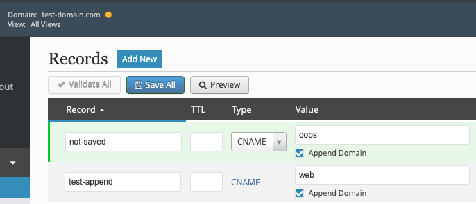

Resource Records are managed by clicking on the zone name from the zone listing. By default, `ALL` resource records (RR) will be displayed, but you can choose which RR to view by selecting one from the upper right. Any RR that has at least one entry will be listed outside of the drop-down menu.

!!! note
    You can add IPv4 A type and IPv6 AAAA type records under the same page. Select A or AAAA from the upper-right and add your IPv4 and IPv6 records and fmDNS will auto-detect their type.

_The **Record Management** or **Super Admin** permission is required to add, edit, and delete records._

## Form Validation
Whenever you add or edit records, the record(s) will need to be validated before they can be saved. Form validation attempts to ensure the data entered is RFC-compliant and flags any field that has bad data. You can either validate each entry individually by clicking the green checkmark at the end of the record row or use the **_Validate All_** button to check all new and modified entries.


## Linked PTR Records
`A` records provide the option to automatically create a `PTR` record with the **Create PTR** checkbox. However, the reverse zone must first exist in order for `PTR` records to automatically be created. You can enable the automatic reverse zone creation in the [**_Settings_**](../../../admin/settings.md#create-reverse-zones-automatically). In this case, the reverse zone will inherit the same SOA as the forward zone. Once an `A` record is created with a `PTR`, the record will show it has a linked `PTR` which can later be updated if the record changes.


!!! note
    If the corresponding reverse zone does not already exist, it can be [automatically created](../../../admin/settings.md#create-reverse-zones-automatically) during the record validation process.

## Append Domain
When adding certain records (such as `CNAME`, `MX`, `SRV`, `SOA`, `NS`, etc.), you have the option append the domain to the record. This means fmDNS will automatically add the domain to the record so you don't have to give the fully qualified domain name in the record value. fmDNS will attempt to auto-detect whether or not the domain should be appended if no choice is made at the time of record creation.


This is helpful if you can't remember if a value needs a trailing period (.) or not.


```
; Aliases
no-append                         IN   CNAME   facilemanager.com.
test-append.test-domain.com.      IN   CNAME   web.test-domain.com.
```

## `CUSTOM` Record
Each zone has a `CUSTOM` RR which allows you to add any other zone data that might not otherwise be supported by fmDNS. Simply click on the `CUSTOM` RR in the upper right, add your content, and **_Save_**.


## Unsaved Records
Whenever a zone has unsaved resource records, there will be a yellow dot next to the domain name in the header as a visual indicator.



## Cloned Zone Records
When viewing the records of a cloned zone, the parent records will not be editable, but you can choose to skip them or add new records that impacts the cloned zone only.


## Import
BIND-compatible zone files can be imported instead of adding records individually. Go to **_Admin → Tools_** and use the Import Zone Files utility. After selecting the file and zone to import to, you have one final chance to review what gets imported before the records are actually imported.

!!! example
    You can generate a zone file to import using `rndc`:
    ```
    rndc dumpdb -zones /path/to/dump/directory/named_dump.db
    ```

--8<--
footer.md
--8<--
