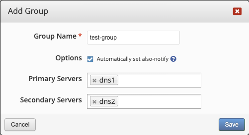
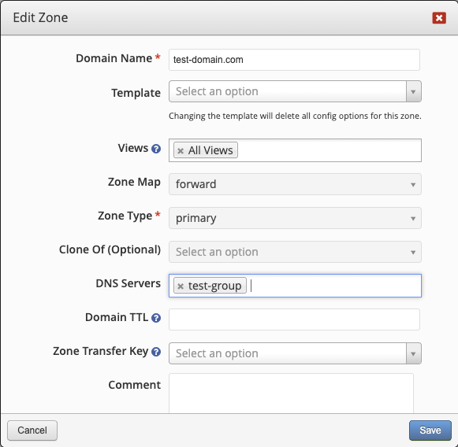

If you have more than one server configured, then you can take advantage of the **Server Groups** which allows you to define a relationship with primary and secondary servers.



When defining (or modifying) a zone, you can choose which DNS servers will host the zone.  This can be specific servers, server groups, or _All Servers_.



When specifying a server group that has primary and secondary servers defined, fmDNS will build the zone differently on each type of server -- as a primary zone on the primaries and a secondary zone on the secondaries while automatically listing the IPs of the `primaries` on the secondaries.  When defining the server group and the **_Automatically set also-notify_** is set, then fmDNS will also automatically define `also-notify` on the primaries with the IPs of the secondaries in the group.

**dns1**
```
===========================================================================
/etc/named/zones/zones.conf.all:
===========================================================================
// This file was built using fmDNS 7.1.1 on Thu, 24 Apr 2025 16:01:11 +0000 UTC

zone "test-domain.com" {
	type primary;
	file "/etc/named/zones/primary/db.test-domain.com.hosts";
	also-notify { 192.168.1.101; };
};
```

**dns2**
```
===========================================================================
/etc/named/zones/zones.conf.all:
===========================================================================
// This file was built using fmDNS 7.1.1 on Thu, 24 Apr 2025 16:02:29 +0000 UTC

zone "test-domain.com" {
	type slave;
	file "/etc/named/zones/slave/db.test-domain.com.0.hosts";
	masters { 192.168.1.100; };
};
```

!!! note
    You can also just define groups consisting of only primary servers to keep zones configured only on certain primary servers.

--8<--
footer.md
--8<--
